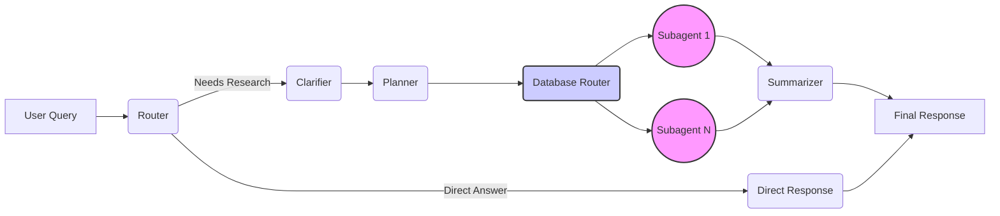

# IRIS Project

[](https://github.com/psf/black)
[](https://www.python.org/downloads/)

## Overview

IRIS (Intelligent Retrieval & Interaction System) is an AI agent-based system designed to answer user queries by interacting with various internal and external financial data sources. It follows a structured pipeline:

1.  **Route:** Determines if the query needs database research or can be answered directly.
2.  **Clarify:** Refines the research goal and scope, potentially asking clarifying questions.
3.  **Plan:** Creates a strategy for which databases to query.
4.  **Query:** Executes queries against selected databases concurrently using specialized subagents.
5.  **Summarize/Respond:** Synthesizes research findings into a coherent answer or returns collected metadata.

## Features

*   **Agent Pipeline:** Orchestrates tasks through specialized agents (Router, Clarifier, Planner, Database Router, Summarizer, Direct Response).
*   **Multi-Source Data Integration:** Connects to various internal databases (Memos, Wiki, PAR, ICFR, Cheatsheets, CAPM) and external sources (EY, IASB, KPMG, PwC) via dedicated subagents.
*   **Intelligent Query Handling:** Routes, clarifies, and plans queries for efficient data retrieval.
*   **Concurrent Database Access:** Queries multiple databases in parallel for faster results.
*   **Response Synthesis & Summarization:** Consolidates information from multiple sources into coherent responses.

### Agent Flow Diagram



## Project Structure

```
iris-project/
├── .gitignore              # Git ignore rules
├── init-schema.sql         # Database initialization schema (Reference)
├── README.md               # This file
├── setup.py                # Project installation script
├── iris/                   # Main Python package
│   └── src/                # Source code
│       ├── agents/         # Core AI agents and subagents ([README](./iris/src/agents/README.md))
│       ├── chat_model/     # Main orchestration logic ([README](./iris/src/chat_model/README.md))
│       ├── conversation_setup/ # Conversation management ([README](./iris/src/conversation_setup/README.md))
│       ├── global_prompts/   # Shared prompts ([README](./iris/src/global_prompts/README.md))
│       ├── initial_setup/    # Configuration, DB, logging, OAuth, SSL setup ([README](./iris/src/initial_setup/README.md))
│       └── llm_connectors/ # Connectors to specific LLMs ([README](./iris/src/llm_connectors/README.md))
├── notebooks/              # Jupyter notebooks for testing, debugging, etc. ([README](./notebooks/README.md))
└── venv/                   # Python virtual environment (if created)
```
(Note: Some utility scripts might exist but are not part of a dedicated `scripts/` directory in the main structure.)

## Getting Started

### Prerequisites

*   Python 3.9+ (recommended)
*   PostgreSQL installed locally

### Installation & Setup

1.  **Clone the repository (if you haven't already):**
    ```bash
    git clone <repository-url>
    cd iris-project
    ```

2.  **Database Setup:**
    This project assumes a PostgreSQL database named `maven-finance` is already running and accessible. The connection details (host, port, user, password) should be configured appropriately for the environment (e.g., via environment variables read by `iris/src/initial_setup/db_config.py`). The required schema is defined in `init-schema.sql` for reference.

3.  **Set up Python Environment:**
    It's recommended to use a virtual environment.
    ```bash
    # Create a virtual environment
    python -m venv venv

    # Activate the environment
    # On macOS/Linux:
    source venv/bin/activate
    # On Windows:
    # venv\Scripts\activate
    ```

4.  **Install Dependencies:**
    Install the project and its dependencies in editable mode.
    ```bash
    # Install base package
    pip install -e .
    
    # Install development tools
    pip install -e ".[dev]"
    ```

## Usage

The primary way to interact with the IRIS system is by running the `test_notebook.ipynb` which calls the main `model()` function.

1.  **Launch Jupyter:**
    ```bash
    jupyter notebook
    ```
2.  **Open and Run:** Navigate to `notebooks/test_notebook.ipynb` in the Jupyter interface. Modify the `conversation` variable within the notebook to ask your query, and then run the cells.

(Note: Some older utility scripts might be present in the codebase but are not the primary method of interaction or management.)

## Development

### Code Style

This project uses:
- [Black](https://black.readthedocs.io/en/stable/) for code formatting
- [MyPy](https://mypy.readthedocs.io/en/stable/) for static type checking
- [Pytest](https://docs.pytest.org/en/stable/) for testing

### Quality Checks

Ensure code quality by running the following checks from the project root:

*   **Formatting (Black):**
    ```bash
    black iris/
    ```
*   **Type Checking (MyPy):**
    ```bash
    mypy iris/
    ```
*   **Testing (Pytest):**
    ```bash
    pytest
    ```

## Documentation

Every module, class, and function should be documented with Google-style docstrings. Type hints should be used for all function parameters and return values.

Example:
```python
def function_name(param1: str, param2: int) -> bool:
    """Short description of function purpose.
    
    Longer description explaining details if needed.
    
    Args:
        param1: Description of first parameter.
        param2: Description of second parameter.
        
    Returns:
        Description of the return value.
        
    Raises:
        ExceptionType: When and why this exception occurs.
    """
    ...
```

## Troubleshooting

### Common Issues

1. **Database Connection Problems**
   - Ensure PostgreSQL is running and accessible.
   - Verify database name and connection credentials used by the application (see `iris/src/initial_setup/db_config.py`).
   - Check network connectivity and firewall rules between the application host and the database server.

2. **Missing Dependencies**
   - Reinstall with: `pip install -e ".[dev]"`
   - Ensure your virtual environment is activated

3. **Jupyter Notebook Issues**
   - Make sure you're running the notebook from within the virtual environment
   - Verify kernel selection in the notebook

## Contributing

When contributing to this project, please follow the existing code style guidelines and add appropriate tests for new features.

1. Fork the repository
2. Create a feature branch (`git checkout -b feature/your-feature`)
3. Make your changes
4. Run tests and ensure code quality checks pass
5. Commit your changes
6. Push to your branch
7. Create a Pull Request

## License

This project is proprietary and confidential. All rights reserved.

## Acknowledgments

* This project uses OpenAI's API for language model capabilities
* Database integration is handled through PostgreSQL
